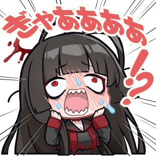
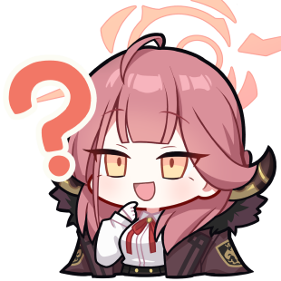
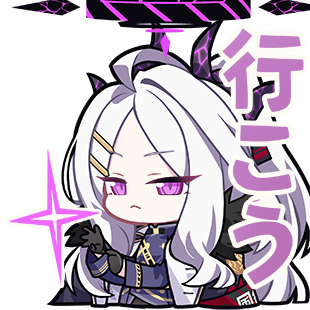
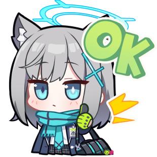
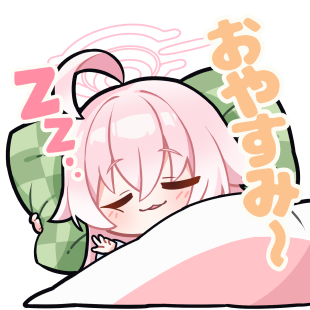

# Firdiansyah Ramadhan

**Senior Unity Developer | Fullstack Game Programmer**

Game developer with 7+ years of experience building engaging player experiences in Unity (C#) and Roblox (Lua). I specialize in translating creative vision into polished, performant gameplay systems — from core mechanics to immersive narrative-driven worlds.

## About Me

- 7+ years in professional game development
- 15+ shipped projects across mobile, PC, and Roblox
- 10+ clients served internationally (Indonesia, Dubai, Vietnam, USA)
- Graduated Cum Laude from Telkom University (GPA 3.82/4.0) in 3.5 years
- Published international journal on Deep Learning for the Game Industry

 

## Technical Skills

- **Game Engines** — Unity 3D (C#), Roblox Studio (Lua)
- **Networking** — Photon Fusion, multiplayer architecture
- **Specializations** — Gameplay systems, AI, physics, graphics, UI/UX, VFX, shader programming
- **Tools** — Git, Docker, CI/CD, PhaserJS
- **Other** — Game design, project management, team mentoring

## Connect

- **LinkedIn** — [linkedin.com/in/firdiar](https://www.linkedin.com/in/firdiar)
- **GitHub** — [github.com/firdiar](https://github.com/firdiar)
- **itch.io** — [gtion.itch.io](https://gtion.itch.io/)
- **Email** — firdi.ansyah20@gmail.com

 

---

## About This Portfolio

A Blue Archive-themed portfolio website featuring an interactive contact experience, background music, and a distinctive anime-inspired visual identity.

Also visit [Persona Portfolio](https://firdiar.github.io/Persona-Portfolio/) — Persona 3 Reload theme portfolio

### Screenshots

| Intro / Loading Screen | Hero Section |
|---|---|
|  |  |

| Recommendations | Contact (Arona Touch) |
|---|---|
|  |  |

### Highlights

- **Blue Archive Aesthetic** — Sky-blue palette, Noto Sans + custom BA logo font, pill-shaped UI, soft rounded cards
- **Intro Screen** — Loading progress bar, "TOUCH TO START" with BA button, particle effects, cinematic Welcome/Sensei transition
- **Interactive Contact Gate** — Inspired by Blue Archive's iconic Arona touch moment; visitors touch a pulsing target to reveal the contact form panel
- **Background Music** — Plays with Now Playing widget, play/pause toggle, disable/re-enable with localStorage persistence
- **Section Backgrounds** — Character art and themed images behind About, Education, and Recommendations
- **Fully Responsive** — Mobile-first layouts with simplified contact flow on portrait devices

 

### Tech Stack

- HTML5, CSS3 (custom properties, animations, grid, flexbox)
- Vanilla JavaScript
- [Swiper.js](https://swiperjs.com/) for carousels
- [Noto Sans](https://fonts.google.com/noto/specimen/Noto+Sans) via Google Fonts
- RoGSanSrfStd-Bd (Blue Archive logo font)

---

  
  
  
  

## License

All rights reserved.
